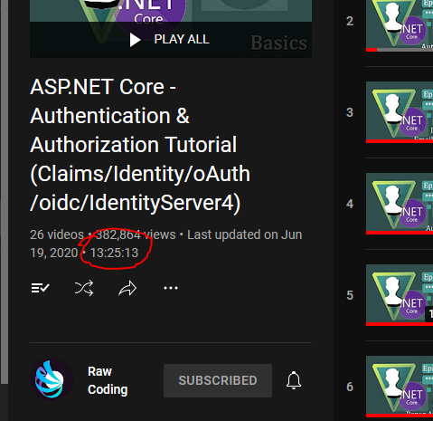
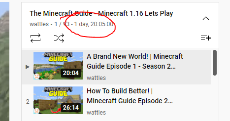
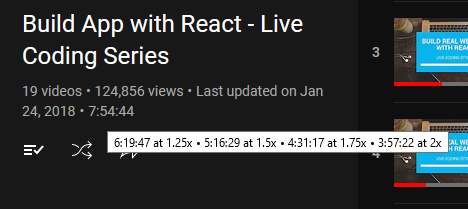

# Browser User Scripts

My custom browser user scripts.

Use [Violentmonkey](https://violentmonkey.github.io/) or any compatible extension to load the scripts into your browser.

## Scripts in this repo

### youtube-playlist-length.js

Adds a text showing the total playlist duration at the description section of the playlist and video within playlist pages.

This script uses the [YouTube Data API](https://developers.google.com/youtube/v3/getting-started) to fetch the playlist info, so you need to provide an `apiKey` value to the Violentmonkey key-value store with a valid [GCP API Key](https://developers.google.com/youtube/registering_an_application).

